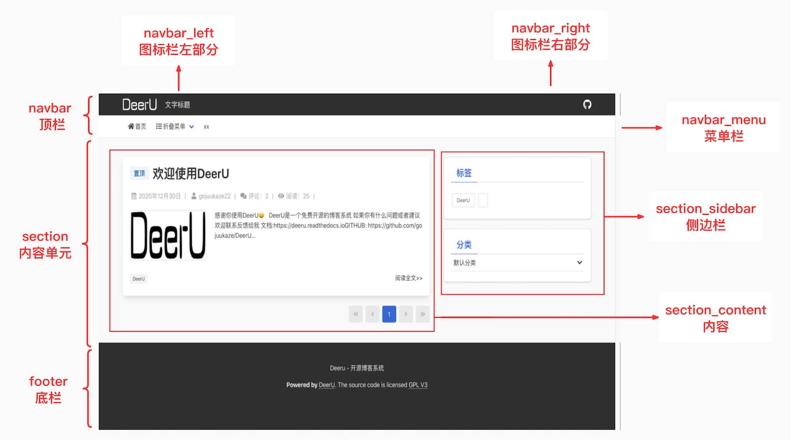

.. _templates:

==============
主题模板
==============

v2.1开始把html代码分作了两个模块： ``head`` 与 ``body`` 。

* head 又分为 ``head_begin`` , ``head_static`` , ``head_end``

* body 又分为 ``body_begin`` , ``body_navbar（顶部图标栏与导航栏）`` , ``body_section（内容与侧边栏）`` , ``body_footer（底栏）`` , ``body_end``

  `` ``body_navbar`` , ``body_section`` , ``body_footer`` 又被继续分作若模块 ``

每个模块对应一个 html template ，可以方便的对局部代码进行微调。

所有页面都集成自一个基础的 template ，如下：

.. code-block:: html

    <!DOCTYPE html>
    <html lang="zh-CN">
    <head>
        
        <meta charset="UTF-8">
        <meta name="viewport" content="width=device-width, initial-scale=1">
        <title>{{ head_title }}</title>
        
        

    </head>
    <body class="deeru-body">
    

    

    

    

    

    </body>

    </html>

html的基础template
=====================

html代码的template包含基础template以及每个页面的独立template，基础template如下

**head**

* ``head_begin_template`` : head开始，默认 ``base_theme2/empty.html``
* ``head_static_template`` : head中的静态文件，默认 ``base_theme2/head_static.html``
* ``head_end_template`` : head结尾，默认 ``base_theme2/empty.html``

**body**

body部分比较复杂，可以参考示意图

* ``body_begin_template`` : body开始，默认 ``base_theme2/empty.html``
* ``body_end_template`` : body end，默认 ``base_theme2/empty.html``
|
* ``body_navbar_template`` : 顶部图标栏，默认 ``base_theme2/body_navbar.html``
* ``body_navbar_left_template`` : 顶部图标栏左部分（及博客名，logo），默认 ``base_theme2/body_navbar_left.html``
* ``body_navbar_right_template`` : 顶部图标栏右部分，默认 ``base_theme2/body_navbar_right.html``
* ``body_navbar_menu_template`` : 顶部导航栏，默认 ``base_theme2/body_navbar_menu.html``
|
* ``body_section_template`` : section，默认 ``base_theme2/body_section.html``
* ``body_section_begin_template`` : section begin，默认 ``base_theme2/empty.html``
* ``body_section_content_template`` : section内容，默认 ``base_theme2/empty.html``
* ``body_section_sidebar_template`` : 侧边栏，默认 ``base_theme2/empty.html``
* ``body_section_sidebar_begin_template`` : 侧边栏begin，默认 ``base_theme2/empty.html``
* ``body_section_sidebar_end_template`` : 侧边栏end，默认 ``base_theme2/empty.html``
* ``body_section_end_template`` : section end，默认 ``base_theme2/empty.html``
|
* ``body_footer_template`` : 底栏，默认 ``base_theme2/body_footer.html``
* ``body_footer_begin_template`` : 底栏begin，默认 ``base_theme2/empty.html``
* ``body_footer_end_template`` : 底栏end，默认 ``base_theme2/empty.html``

每个页面单独的context
========================

每个页面单独的 context 见 :ref:`page-c-t`