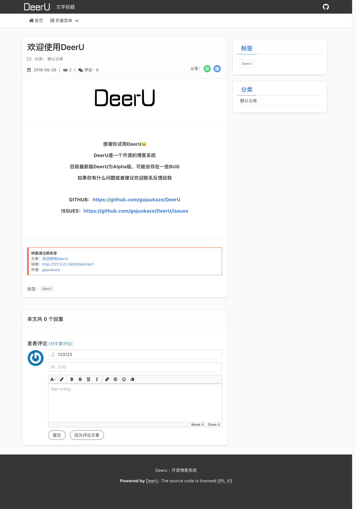
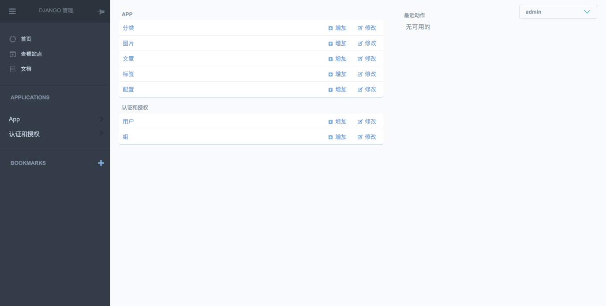
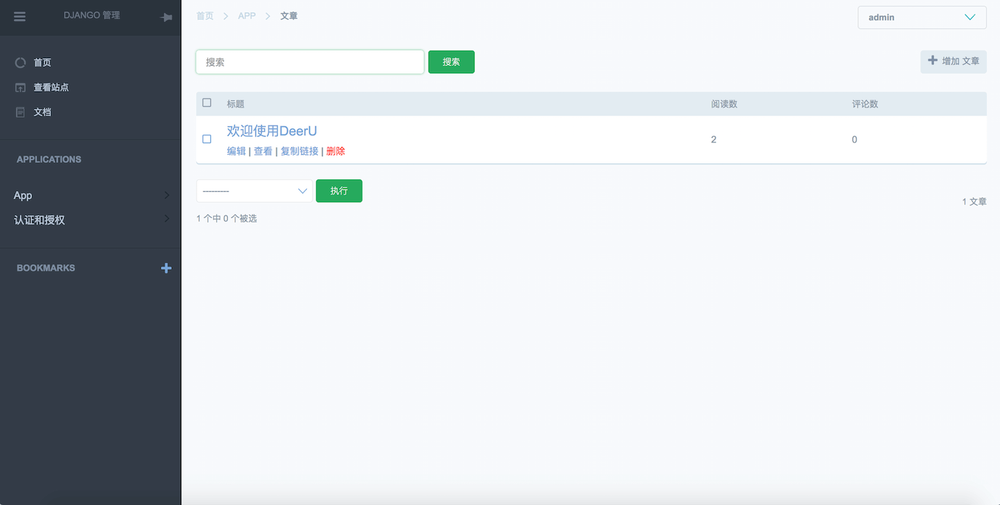
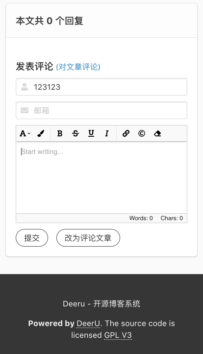

.. DeerU documentation master file, created by
   sphinx-quickstart on Tue May 29 10:52:05 2018.
   You can adapt this file completely to your liking, but it should at least
   contain the root `toctree` directive.

Welcome to DeerU's documentation!
=================================

Deeru
=======

**DeerU是一个开源博客系统，它基于django开发**

.. image:: _static/deeru_green.png
    :scale: 50%

* github : https://github.com/gojuukaze/DeerU
* docs : https://deeru.readthedocs.io
* demo : https://www.ikaze.cn

依赖
========
  python 3+

  django 2.0+

=========

.. toctree::
   :maxdepth: 2
   :caption: 目录:

   installation
   upgrade
   user_guide/index
   developer_guide/index
   change_log

License
=============

DeerU使用 `GNU General Public License v3.0 协议 <https://github.com/gojuukaze/DeerU/blob/master/LICENSE>`_ ，
你可以在遵循此协议的情况下免费使用DeerU

.. warning::

    需要注意的是，DeerU本身是免费的，但后台管理使用了富文本编辑器froala，其扩展插件并不免费，你可以在以下链接中查看收费信息：

    https://github.com/froala/django-froala-editor#license

    https://froala.com/wysiwyg-editor/pricing

    你可以自己更换其他编辑器（ 参考 :ref:`rich-text-editor` ），我也会在之后内置一些富文本编辑器的替代方案 

截图
===============

首页

.. image:: _static/home.png
    :scale: 50%

文章详情

admin

admin2

admin3

手机端页面

手机端页面

手机端页面

-------------

Indices and tables
==================

* :ref:`genindex`
* :ref:`modindex`
* :ref:`search`
