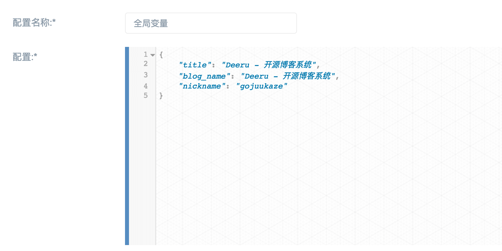

.. _config-summary:

==========
配置
==========

DeerU的所有配置都采用json格式文件进行配置，你可以在 http://127.0.0.1:8000/admin/app/config/ 中查看修改配置

.. note::

   需要注意的是配置文件中bool值采用0，1表示，0-flase, 1-true

如图：

------------------

你一共有3大部分可以进行配置：

.. toctree::
   :maxdepth: 2

   global_config
   common_config
   ui_config
   type
