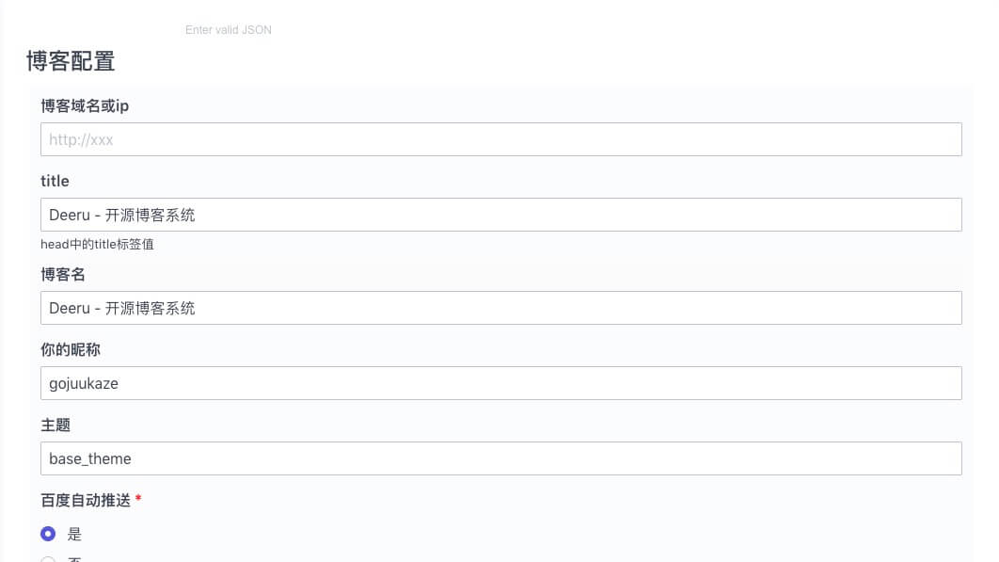
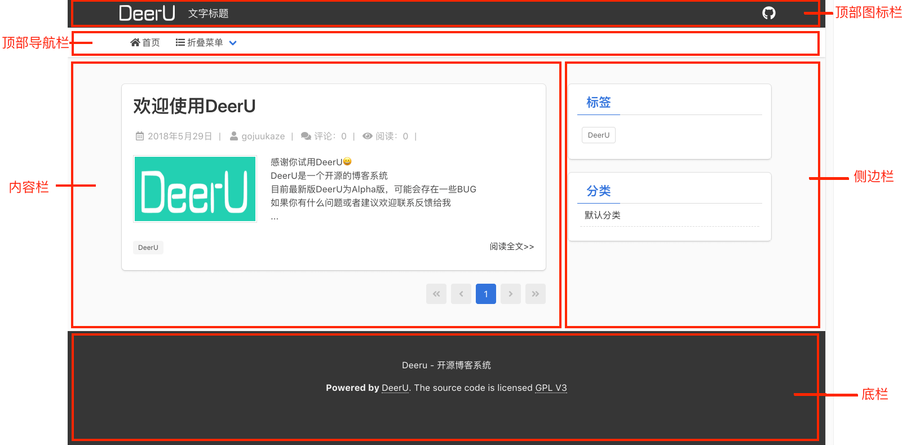

.. _config-summary:

==========
配置
==========

你可以在 http://127.0.0.1:8000/admin/app/config/ 中查看修改配置

v1版本中DeerU的所有配置都采用json格式进行配置，v2版使用 `json-editor <https://github.com/json-editor/json-editor>`_ 对配置进行了可视化改造。


如图：



------------------

v2版本一共有4大配置：

  * 博客配置
  * 顶部导航栏配置
  * 顶部图标栏配置
  * 通用配置

博客配置
---------

* 博客域名或ip ： 指向博客首页的地址
* title ： 一般就是博客名，会写到html的title标签中
* 博客名
* 昵称
* 主题 ： 使用的主题
* 百度自动推送 ： 百度的js推送，帮助优化搜索
* 邮箱配置 ： 开启后，但评论有回复时会发邮件通知评论者

顶部导航栏配置
----------------

导航栏位置如图：



点击 ``+`` 可增加导航项，每个导航有4个可子项：

  * 名字
  * url

    - 其中分类链接，tag链接填写的是 分类/tag的id或名称，最终会生成跳转到分类/tag目录的url
  * img

    - 图片id，图片名： 为上传到相册中的图片
    - fontawesome图标： 使用的是 `fontawesome <https://fontawesome.com/icons?d=gallery&m=free>`_ 图标，
      base_theme使用的是fontawesome5版本，你可以在其官网中获取需要的图标
    - svg图片
    - 属性： html标签得到属，最终会添加到html标签内。
      如：``style=width:50;height:50 | id=1`` 对应的html代码为 ````
  * 二级导航

顶部图标栏配置
----------------

图标栏分类左右两部分，可分别配置

通用配置
-----------

这是key-value的配置，通用给开发者方便的增加配置项
